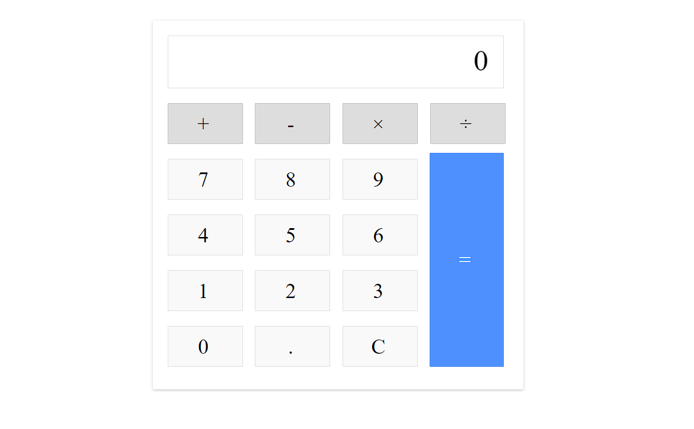

# Classic Calculator

(https://calculator-classic-v1.netlify.app/)

## Description

This is a simple classic calculator application created using javascript. It performs basic arithmetic operations such as addition, subtraction, multiplication, and division.

## Features

- Addition
- Subtraction
- Multiplication
- Division
